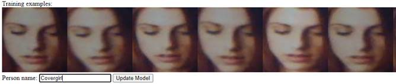
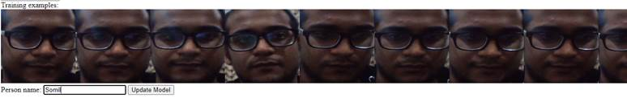
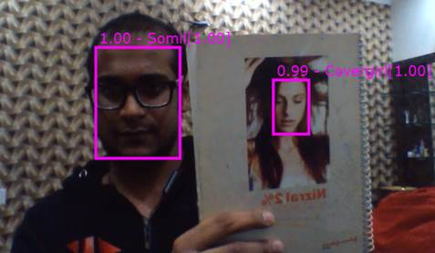

::: {.WordSection1}
 

**[]{style="mso-ascii-font-family:Calibri;mso-fareast-font-family:\"Times New Roman\";
  mso-hansi-font-family:Calibri;mso-bidi-font-family:Calibri;color:white"}**

 

**[AI [Model :]{.GramE} AI Image Colorizer -
Description]{style="font-size:16.0pt;mso-ascii-font-family:Calibri;mso-fareast-font-family:
  \"Times New Roman\";mso-hansi-font-family:Calibri;mso-bidi-font-family:Calibri;
  color:white"}**

**[]{style="font-size:16.0pt;mso-ascii-font-family:Calibri;mso-fareast-font-family:
  \"Times New Roman\";mso-hansi-font-family:Calibri;mso-bidi-font-family:Calibri;
  color:white"}**

 
:::

**[Overview]{style="font-size:10.0pt;mso-ascii-font-family:Calibri;mso-fareast-font-family:
  \"Times New Roman\";mso-hansi-font-family:Calibri;mso-bidi-font-family:Calibri;
  color:black;mso-color-alt:windowtext"}[]{style="font-size:10.0pt;mso-ascii-font-family:Calibri;mso-fareast-font-family:
  \"Times New Roman\";mso-hansi-font-family:Calibri;mso-bidi-font-family:Calibri"}**

[The idea is to build application for a real-time face detection and
recognition using [Tensorflow]{.SpellE} and a notebook\'s webcam. The
model for face prediction should be easy to update online to add new
targets.]{style="font-size:10.0pt;font-family:\"Arial\",sans-serif;
  mso-fareast-font-family:\"Times New Roman\";color:black;mso-color-alt:windowtext"}[]{style="font-size:10.0pt;font-family:\"Arial\",sans-serif;mso-fareast-font-family:
  \"Times New Roman\""}

[]{style="font-size:10.0pt;font-family:\"Arial\",sans-serif;
  mso-fareast-font-family:\"Times New Roman\""}

 

**[Model
Metadata]{style="font-size:10.0pt;mso-ascii-font-family:Calibri;mso-fareast-font-family:
  \"Times New Roman\";mso-hansi-font-family:Calibri;mso-bidi-font-family:Calibri;
  color:black;mso-color-alt:windowtext"}[]{style="font-size:10.0pt;mso-ascii-font-family:Calibri;mso-fareast-font-family:
  \"Times New Roman\";mso-hansi-font-family:Calibri;mso-bidi-font-family:Calibri"}**

[[Domain :]{style="font-size:10.0pt;font-family:\"Arial\",sans-serif;
  mso-fareast-font-family:\"Times New Roman\";color:black;mso-color-alt:windowtext"}]{.GramE}[
Vision]{style="font-size:10.0pt;font-family:\"Arial\",sans-serif;
  mso-fareast-font-family:\"Times New Roman\";color:black;mso-color-alt:windowtext"}[]{style="font-size:10.0pt;font-family:\"Arial\",sans-serif;
  mso-fareast-font-family:\"Times New Roman\""}

[[Application
:]{style="font-size:10.0pt;font-family:\"Arial\",sans-serif;
  mso-fareast-font-family:\"Times New Roman\";color:black;mso-color-alt:windowtext"}]{.GramE}[
Face Tagging]{style="font-size:10.0pt;font-family:\"Arial\",sans-serif;
  mso-fareast-font-family:\"Times New Roman\";color:black;mso-color-alt:windowtext"}[]{style="font-size:10.0pt;font-family:\"Arial\",sans-serif;
  mso-fareast-font-family:\"Times New Roman\""}

[[Industry :]{style="font-size:10.0pt;font-family:\"Arial\",sans-serif;
  mso-fareast-font-family:\"Times New Roman\";color:black;mso-color-alt:windowtext"}]{.GramE}[
General]{style="font-size:10.0pt;font-family:\"Arial\",sans-serif;
  mso-fareast-font-family:\"Times New Roman\";color:black;mso-color-alt:windowtext"}[]{style="font-size:10.0pt;font-family:\"Arial\",sans-serif;
  mso-fareast-font-family:\"Times New Roman\""}

[Training [Data :]{.GramE}
Image]{style="font-size:10.0pt;font-family:\"Arial\",sans-serif;
  mso-fareast-font-family:\"Times New Roman\";color:black;mso-color-alt:windowtext"}[]{style="font-size:10.0pt;
  font-family:\"Arial\",sans-serif;mso-fareast-font-family:\"Times New Roman\""}

[Input Data [Format :]{.GramE}
Image]{style="font-size:10.0pt;font-family:\"Arial\",sans-serif;
  mso-fareast-font-family:\"Times New Roman\";color:black;mso-color-alt:windowtext"}[]{style="font-size:
  10.0pt;font-family:\"Arial\",sans-serif;mso-fareast-font-family:\"Times New Roman\""}

[**[Dockehub]{style="font-size:10.0pt;mso-ascii-font-family:Calibri;mso-fareast-font-family:
  \"Times New Roman\";mso-hansi-font-family:Calibri;mso-bidi-font-family:Calibri;
  color:black;mso-color-alt:windowtext"}**]{.SpellE}**[
Link]{style="font-size:10.0pt;mso-ascii-font-family:Calibri;mso-fareast-font-family:
  \"Times New Roman\";mso-hansi-font-family:Calibri;mso-bidi-font-family:Calibri;
  color:black;mso-color-alt:windowtext"}[]{style="font-size:10.0pt;mso-ascii-font-family:Calibri;mso-fareast-font-family:
  \"Times New Roman\";mso-hansi-font-family:Calibri;mso-bidi-font-family:Calibri"}**

[[https://hub.docker.com/r/btwardow/tf-face-recognition]{style="mso-ascii-font-family:Calibri;mso-fareast-font-family:
  \"Times New Roman\";mso-hansi-font-family:Calibri;mso-bidi-font-family:Calibri;
  color:#0563C1"}]{.underline}

**[Deployment]{style="font-size:10.0pt;mso-ascii-font-family:Calibri;mso-fareast-font-family:
  \"Times New Roman\";mso-hansi-font-family:Calibri;mso-bidi-font-family:Calibri;
  color:black;mso-color-alt:windowtext"}[]{style="font-size:10.0pt;mso-ascii-font-family:Calibri;mso-fareast-font-family:
  \"Times New Roman\";mso-hansi-font-family:Calibri;mso-bidi-font-family:Calibri"}**

[https://hub.docker.com/r/btwardow/tf-face-recognition]{style="font-size:10.0pt;font-family:\"Arial Unicode MS\",serif;
  mso-fareast-font-family:\"Times New Roman\";mso-bidi-font-family:Calibri;
  color:black;mso-color-alt:windowtext"}[]{style="font-size:10.0pt;font-family:\"Arial Unicode MS\",serif;mso-fareast-font-family:
  \"Times New Roman\";mso-bidi-font-family:Calibri"}

**[Model Testing
]{style="font-size:10.0pt;mso-ascii-font-family:Calibri;mso-fareast-font-family:
  \"Times New Roman\";mso-hansi-font-family:Calibri;mso-bidi-font-family:Calibri;
  color:black;mso-color-alt:windowtext"}[]{style="font-size:10.0pt;mso-ascii-font-family:Calibri;mso-fareast-font-family:
  \"Times New Roman\";mso-hansi-font-family:Calibri;mso-bidi-font-family:Calibri"}**

[https://localhost:5000/]{style="font-size:10.0pt;mso-ascii-font-family:Calibri;
  mso-fareast-font-family:\"Times New Roman\";mso-hansi-font-family:Calibri;
  mso-bidi-font-family:Calibri;color:black;mso-color-alt:windowtext"}[]{style="font-size:10.0pt;mso-ascii-font-family:Calibri;mso-fareast-font-family:
  \"Times New Roman\";mso-hansi-font-family:Calibri;mso-bidi-font-family:Calibri"}

**[Sample
Input]{style="font-size:10.0pt;mso-ascii-font-family:Calibri;mso-fareast-font-family:
  \"Times New Roman\";mso-hansi-font-family:Calibri;mso-bidi-font-family:Calibri;
  color:black;mso-color-alt:windowtext"}[]{style="font-size:10.0pt;mso-ascii-font-family:Calibri;mso-fareast-font-family:
  \"Times New Roman\";mso-hansi-font-family:Calibri;mso-bidi-font-family:Calibri"}**

{width="668"
height="142"}[]{style="font-size:10.0pt;
  mso-ascii-font-family:Calibri;mso-fareast-font-family:\"Times New Roman\";
  mso-hansi-font-family:Calibri;mso-bidi-font-family:Calibri"}

[]{style="font-size:10.0pt;mso-ascii-font-family:Calibri;
  mso-fareast-font-family:\"Times New Roman\";mso-hansi-font-family:Calibri;
  mso-bidi-font-family:Calibri"}

 

[]{style="font-size:10.0pt;mso-ascii-font-family:Calibri;
  mso-fareast-font-family:\"Times New Roman\";mso-hansi-font-family:Calibri;
  mso-bidi-font-family:Calibri"}

 

{width="774"
height="122"}[]{style="font-size:10.0pt;
  mso-ascii-font-family:Calibri;mso-fareast-font-family:\"Times New Roman\";
  mso-hansi-font-family:Calibri;mso-bidi-font-family:Calibri"}

**[Sample
Response]{style="font-size:10.0pt;mso-ascii-font-family:Calibri;mso-fareast-font-family:
  \"Times New Roman\";mso-hansi-font-family:Calibri;mso-bidi-font-family:Calibri;
  color:black;mso-color-alt:windowtext"}[]{style="font-size:10.0pt;mso-ascii-font-family:Calibri;mso-fareast-font-family:
  \"Times New Roman\";mso-hansi-font-family:Calibri;mso-bidi-font-family:Calibri"}**

[{width="477"
height="278"}]{style="color:black;mso-color-alt:windowtext;mso-no-proof:yes"}[]{style="font-size:10.0pt;mso-ascii-font-family:Calibri;mso-fareast-font-family:
  \"Times New Roman\";mso-hansi-font-family:Calibri;mso-bidi-font-family:Calibri"}

 
