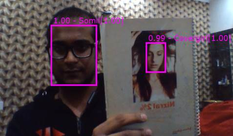

**AI Model : AI Image Colorizer - Description**

**Overview**

The idea is to build application for a real-time face detection and recognition using Tensorflow and a notebook's webcam. The model for face prediction should be easy to update online to add new targets.

**Model Metadata**

Domain : Vision

Application : Face Tagging

Industry : General

Training Data : Image

Input Data Format : Image

**Dockehub** **Link**

https://hub.docker.com/r/btwardow/tf-face-recognition

**Deployment**

https://hub.docker.com/r/btwardow/tf-face-recognition

**Model Testing**

https://localhost:5000/

**Sample Input**

**Sample Response**

