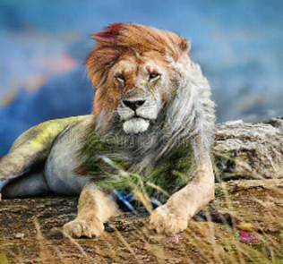

**AI Model : AI Image Colorizer - Description**

**Overview**

This repository contains code to instantiate and deploy an image translation model. This model is a Generative Adversarial Network (GAN) that was trained on COCO dataset images converted to grayscale and produces colored images. The input to the model is a grayscale image (jpeg or png), and the output is a colored 256 by 256 imageThe code in this repository deploys the model as a web service in a Docker container.

**Model Metadata**

Domain : Vision

Application : Image Coloring

Industry : General

Framework : Tensorflow

Training Data : COCO Dataset

Input Data Format : PNG /JPEG Image

**Dockehub** **Link**

https://hub.docker.com/r/codait/max-image-colorizer

**Deployment**

Deployment from dockerhub:  
docker run -it -p 5000:5000 codait/max-image-colorizer

**Model Testing**

curl -X POST "http://localhost:5000/model/predict" -H "accept: application/json" -H "Content-Type: multipart/form-data" -F "image=@lion.jpg;type=image/jpeg" --output lion\_c.jpg

**Sample Input**

**Sample Response**

