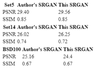
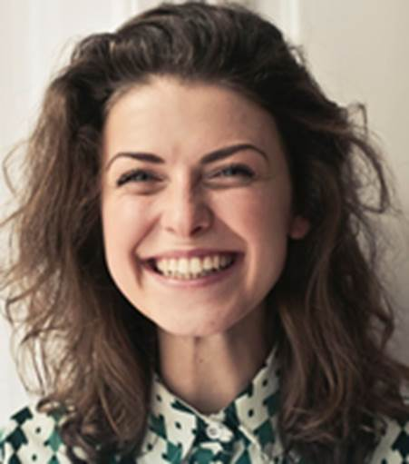
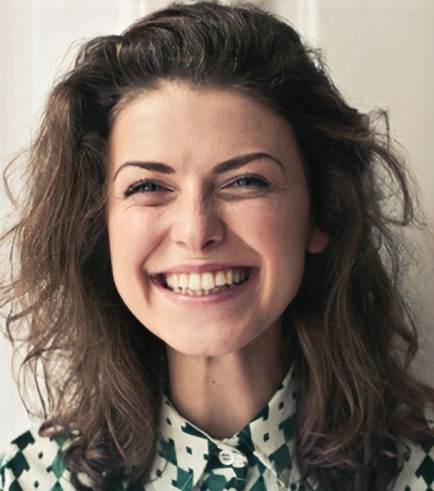

           <!-- /\* Font Definitions \*/ @font-face {font-family:"Cambria Math"; panose-1:2 4 5 3 5 4 6 3 2 4; mso-font-charset:0; mso-generic-font-family:roman; mso-font-pitch:variable; mso-font-signature:-536869121 1107305727 33554432 0 415 0;} @font-face {font-family:Calibri; panose-1:2 15 5 2 2 2 4 3 2 4; mso-font-charset:0; mso-generic-font-family:swiss; mso-font-pitch:variable; mso-font-signature:-469750017 -1073732485 9 0 511 0;} @font-face {font-family:"Arial Unicode MS"; panose-1:2 11 6 4 2 2 2 2 2 4; mso-font-alt:Arial; mso-font-charset:0; mso-generic-font-family:roman; mso-font-pitch:variable; mso-font-signature:3 0 0 0 1 0;} /\* Style Definitions \*/ p.MsoNormal, li.MsoNormal, div.MsoNormal {mso-style-unhide:no; mso-style-qformat:yes; mso-style-parent:""; margin-top:0in; margin-right:0in; margin-bottom:8.0pt; margin-left:0in; line-height:105%; mso-pagination:widow-orphan; font-size:11.0pt; font-family:"Calibri",sans-serif; mso-ascii-font-family:Calibri; mso-ascii-theme-font:minor-latin; mso-fareast-font-family:Calibri; mso-fareast-theme-font:minor-latin; mso-hansi-font-family:Calibri; mso-hansi-theme-font:minor-latin; mso-bidi-font-family:"Times New Roman"; mso-bidi-theme-font:minor-bidi;} a:link, span.MsoHyperlink {mso-style-noshow:yes; mso-style-priority:99; color:#0563C1; text-decoration:underline; text-underline:single;} a:visited, span.MsoHyperlinkFollowed {mso-style-noshow:yes; mso-style-priority:99; color:#954F72; mso-themecolor:followedhyperlink; text-decoration:underline; text-underline:single;} p.msonormal0, li.msonormal0, div.msonormal0 {mso-style-name:msonormal; mso-style-unhide:no; mso-margin-top-alt:auto; margin-right:0in; mso-margin-bottom-alt:auto; margin-left:0in; mso-pagination:widow-orphan; font-size:12.0pt; font-family:"Times New Roman",serif; mso-fareast-font-family:"Times New Roman"; mso-fareast-theme-font:minor-fareast;} .MsoChpDefault {mso-style-type:export-only; mso-default-props:yes; font-size:10.0pt; mso-ansi-font-size:10.0pt; mso-bidi-font-size:10.0pt; font-family:"Calibri",sans-serif; mso-ascii-font-family:Calibri; mso-ascii-theme-font:minor-latin; mso-fareast-font-family:Calibri; mso-fareast-theme-font:minor-latin; mso-hansi-font-family:Calibri; mso-hansi-theme-font:minor-latin; mso-bidi-font-family:"Times New Roman"; mso-bidi-theme-font:minor-bidi;} /\* Page Definitions \*/ @page {mso-footnote-separator:url("ai-image-resolution-enhancer-description\_files/header.html") fs; mso-footnote-continuation-separator:url("ai-image-resolution-enhancer-description\_files/header.html") fcs; mso-endnote-separator:url("ai-image-resolution-enhancer-description\_files/header.html") es; mso-endnote-continuation-separator:url("ai-image-resolution-enhancer-description\_files/header.html") ecs;} @page WordSection1 {size:8.5in 11.0in; margin:1.0in 1.0in 1.0in 1.0in; mso-header-margin:.5in; mso-footer-margin:.5in; mso-paper-source:0;} div.WordSection1 {page:WordSection1;} -->  

**AI Model : AI Image Resolution Enhancer - Description**

**Overview**

This model is able to upscale a pixelated image by a factor of 4, while generating photo-realistic details. The backbone of this neural network is a Generative Adversarial Network (GAN) trained on 600,000 images of the OpenImages V4 dataset.

The GAN is based on SRGAN-tensorflow GitHub repository

**Model Metadata**

Domain : Vision

Application : Super-Resolution

Industry : General

Framework : Tensorflow

Training Data : OpenImages V4

Input Data Format : Image (RGB/HWC)

**Benchmark**

The performance of this implementation was evaluated on three datasets: Set5, Set14, and BSD100. The PSNR (peak signal to noise ratio) and SSIM (structural similarity index) metrics were evaluated, although the paper discusses the MOS (mean opinion score) as the most favorable metric. In essence, the SRGAN implementation trades a better PSNR or SSIM score for a result more appealing to the human eye. This leads to a collection of output images with more crisp and realistic details.

NOTE: The SRGAN in the paper was trained on 350k ImageNet samples, whereas this SRGAN was trained on 600k OpenImages V4 pictures.

**Dockehub Link**

https://hub.docker.com/r/codait/max-image-resolution-enhancer

**Deployment**

Deployment from dockerhub:

docker run -it -p 5000:5000 codait/max-image-resolution-enhancer

**Model Testing**

curl -X POST "http://localhost:5001/model/predict" -H "accept: application/json" -H "Content-Type: multipart/form-data" -F "image=@image\_enhancement.PNG;type=image/png"

**Sample Input**

**Sample Output**

