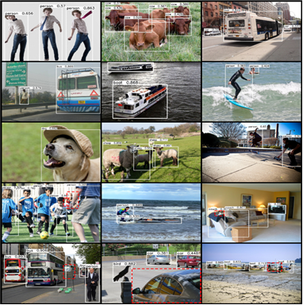

**AI Model : AI Object Detector - Description**

**Overview**

This model recognizes the objects present in an image from the 80 different high-level classes of objects in the COCO Dataset. The model consists of a deep convolutional net base model for image feature extraction, together with additional convolutional layers specialized for the task of object detection, that was trained on the COCO data set. The input to the model is an image, and the output is a list of estimated class probabilities for the objects detected in the image. The model is based on the SSD Mobilenet V1 object detection model for TensorFlow.

**Model Metadata**

Domain : Vision

Application : Object Detection

Industry : General

Framework : Tensorflow

Training Data : COCO Dataset

Input Data Format : Image (RGB/HWC)

**Dockehub** **Link**

https://hub.docker.com/r/codait/max-object-detector

**Deployment**

Deployment from dockerhub:

docker run -it -p 5000:5000 codait/max-object-detector

**Model Testing**

curl -X POST "http://localhost:5000/model/predict?threshold\=0.5" -H "accept: application/json" -H "Content-Type: multipart/form-data" -F "image=@x15.png;type\=image/png"

**Sample Input**

**Sample Output**

{

 "status": "ok",

 "predictions": \[

 {

 "label\_id": "18",

 "label": "dog",

 "probability": 0.8639843463897705,

 "detection\_box": \[

 0.41566020250320435,

 ...

 \]

 },

 {

 "label\_id": "1",

 "label": "person",

 "probability": 0.564839243888855,

 "detection\_box": \[

 0.893539309501648,

 ...

 \]

 },

 \]

}