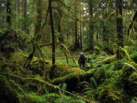

**AI Model : AI Scene Classifier - Testing**

**Model Testing cURL command**

curl -X POST "http://localhost:5000/model/predict" -H "accept: application/json" -H "Content-Type: multipart/form-data" -F [image=@rainforest.PNG;type=image/png](mailto:image=@rainforest.PNG;type=image/png)

**Model Testing Python Code**

· Download the test image from the link :  
https://github.com/PrezSeah/pretrained-model-info/tree/main/model-samples/ai-scene-classifier/sample\_input

· Ensure to have python / anaconda in your system

· Run the following snippet (keep the test image in working directory or provide the image location in the code)

import requests

res = requests.post('http://localhost:5000/model/predict', 

 files = {'image' : (rainforest.jpg', open('sample\_input/rainforest.jpg', 'rb'), 'image/png')})

res.content  
  

**Sample Input**

**Sample Response**

{

 "status": "ok",

 "predictions": \[

 {

 "label\_id": "279",

 "label": "rainforest",

 "probability": 0.937177836894989

 },

 {

 "label\_id": "150",

 "label": "forest/broadleaf",

 "probability": 0.04333578050136566

 },

 {

 "label\_id": "151",

 "label": "forest\_path",

 "probability": 0.006666921079158783

 },

 {

 "label\_id": "323",

 "label": "swamp",

 "probability": 0.004010303411632776

 },

 {

 "label\_id": "36",

 "label": "bamboo\_forest",

 "probability": 0.0019691523630172014

 }

 \]

}